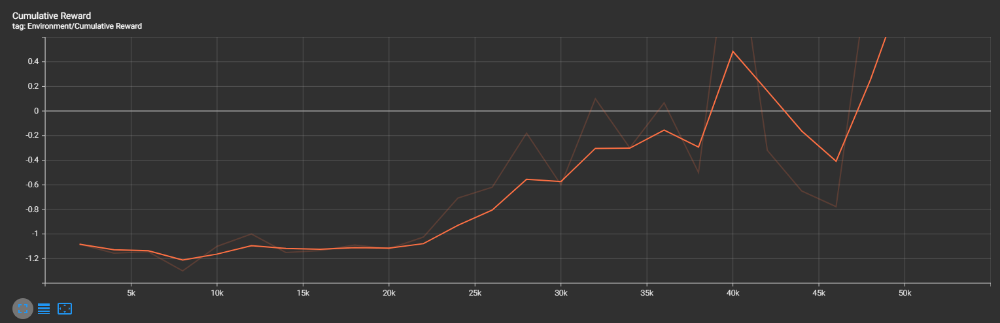
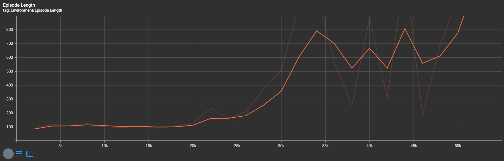
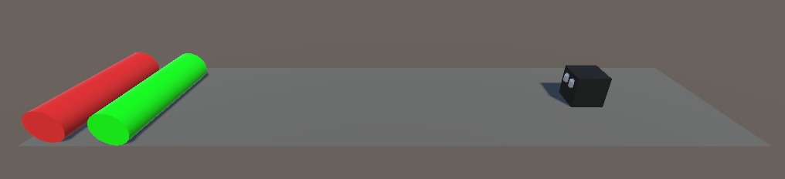

# Jumper Assignment

**Team:**
Thibeau Duerinck - S129732
Nicolas Schoofs - S130014

## Doel

In deze opdracht trainen we een agent om ofwel over een object heen te springen of te colliden met het object, gebaseerd op de kleur van het object dat naar de agent toe gaat. Rode objecten moeten ontweken worden, groene objecten moeten aangeraakt worden.

## Reward systeem

### Beloning

- **+0.5** wanneer de agent een groen object ontwijkt

### Penalties

- **-0.6** wanneer de agent van het platform valt
- **-0.2** wanneer de agent een rood object aanraakt
- **-0.1** wanneer de agent foutief springt

De penalty voor het foutief springen zorgt ervoor dat de agent niet onnodig zal springen.

## Agent Configuratie:

**jumper.yaml**:

       behaviors:
          jumper:
            trainer_type: ppo
            hyperparameters:
              batch_size: 128
              buffer_size: 2048
              learning_rate: 0.0003
              beta: 0.005
              epsilon: 0.2
              lambd: 0.9
              num_epoch: 5
              learning_rate_schedule: linear
              beta_schedule: constant
              epsilon_schedule: linear
            network_settings:
              normalize: false
              hidden_units: 128
              num_layers: 2
            reward_signals:
              extrinsic:
                gamma: 0.90
                strength: 1.0
            max_steps: 50000
            time_horizon: 64
            summary_freq: 2000

## Training

### Tensorboard grafieken:

**Rewards:**

**Episode Length**

Een episode stopt wanneer de agent van het platform wordt geduwd. In dit geval is het resultaat dus beter wanneer de episode langer is.

Onze eerste training verliep niet zo soepel. De agent zag het verschil niet tussen een groen en rood object, waardoor hij een soort gok gedrag ontwikkelde. Soms springen en soms niet, ongeacht de kleur van het object.

Na een paar aanpassingen en de agent opnieuw trainen, kregen we het gewenste resultaat.

## Resultaat

<video width="100%" height="240" controls>
  <source src="./images/result.mp4" type="video/mp4">
Your browser does not support the video tag.
</video>

## Tutorial

### Setup

Maak de volgende objecten aan in Unity:

- Agent
- Collectable
- Obstacle
- Platform
- Object Spawner (Empty game object)

Het zou er zo uit moeten zien:

Voeg een `Rigidbody` en `BoxCollider` toe aan het Agent object. Voeg vervolgens het `AgentBehaviour` script toe. Alternatief kan je ook zelf een script schrijven voor het springen en het beloningssysteem. Ten slotte voegen we de `Ray Perception Sensor`, `Behavior Parameters` en `Decision Requester` scripts toe.

Voeg het `ObstacleBehaviourScript` script toe aan zowel de Obstacle als de Collectable prefab.

Aan een Empty game object voegen we het `ObstacleSpawnerScript` script toe. In de inspector voegen we de 2 prefabs, Collectable en Obstacle, toe.

### Agent trainen en gebruiken

Maak in de root van het project een `config` folder, met hierin de `jumper.yaml` configuratie file die hierboven te vinden is.

Start de training via de cmd.

Na het trainen kan het resultaat gevonden worden in de `results` folder. Het gemaakte `.onnx` bestand kopiëren we naar de `Models` folder die zich in de `Assets` bevindt.

In de inspector van het Agent object kunnen we ons getrainde model toevoegen bij `Behavior Parameters` -> `Model`

Wanneer er nu op de playbutton geklikt wordt, zal het getrainde brein gebruikt worden.
